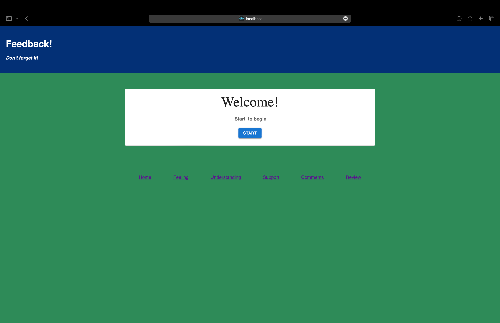

# Project Name

##### Redux Feedback Loop #####

## Description

Week 11 React / Redux

For this assignment, I created a reflection/feedback form modeled after Prime's system. Feedback will be collected over 4 views. In a separate review page, display the current feedback values and a submit button. and when all steps are complete, the app will save the feedback in the database.  

## Screen Shot

On load, the user should see the following:

## Installation
Run 'npm run server' in your terminal
Run 'npm run client' in your terminal

The database.sql file includes information about the database used in this project

## Use
Proceed through the forms by responding to each, 4 total:

The admin page can be accessed by using 'localhost:3000/#/admin'
- proceed here to see a table of all the feedback data with options to flag or delete line items

## Built with:
- Node
- React
- Redux 
- Material UI
- Sweet Alerts 2
- Javascript
- Postgres
- Postico used for database, Postman used for testing back end

## Acknowledgement

Thanks to Emerging Digital Academy who equipped and helped me to make this application a reality!